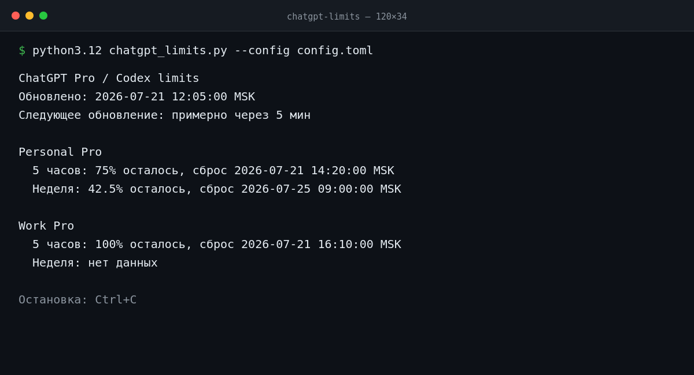

# ChatGPT Limits

Один терминал для пятчасового и недельного лимитов Codex во всех ваших учётных записях ChatGPT Pro.

Если аккаунтов два, встроенного экрана лимитов быстро перестаёт хватать: приходится переключаться между ними и
держать в голове, где сколько осталось. ChatGPT Limits собирает эти значения на одном экране, обновляет их по
расписанию и не прячет исправный аккаунт, если соседний временно не отвечает.



<sub>На скриншоте демонстрационные значения. Приложение показывает данные, которые Codex вернул для ваших аккаунтов.</sub>

## Что здесь важно

- Несколько аккаунтов на одном экране. Новый аккаунт добавляется в TOML, Python-код менять не нужно.
- Официальный вход через `codex login`. Приложение не просит пароль, не принимает API-ключ и не управляет браузером.
- Отдельный `CODEX_HOME` для каждого аккаунта: сессии не смешиваются даже при одновременном опросе.
- Первый запрос уходит сразу после запуска, следующие — через заданный интервал.
- Ошибка одного аккаунта остаётся в его блоке; остальные продолжают обновляться.
- Никакого парсинга страниц ChatGPT и закрытых HTTP-эндпоинтов. Данные приходят из документированного Codex App Server.
- Никаких Python-пакетов поверх стандартной библиотеки 3.12.

## Быстрый старт

Понадобятся macOS или Linux, Python 3.12, установленный [Codex CLI](https://learn.chatgpt.com/docs/codex/cli) и
браузер для первого входа. Команда `codex` должна быть доступна в `PATH`.

1. Создайте рабочую конфигурацию:

   ```bash
   cp config.example.toml config.toml
   ```

2. Оставьте в `config.toml` свои аккаунты. `slug` — короткий локальный идентификатор, `name` — подпись на экране:

   ```toml
   refresh_seconds = 300

   [[accounts]]
   slug = "personal"
   name = "Personal Pro"

   [[accounts]]
   slug = "work"
   name = "Work Pro"
   ```

3. Один раз войдите в каждый аккаунт. Важно использовать тот же файл конфигурации, с которым затем запустится
   монитор:

   ```bash
   python3.12 chatgpt_limits.py --config config.toml --login personal
   python3.12 chatgpt_limits.py --config config.toml --login work
   ```

   Codex откроет официальный вход ChatGPT в браузере. Перед второй командой убедитесь, что в браузере выбран второй
   аккаунт. Обычный вход из `~/.codex` здесь намеренно не переиспользуется: именно это не даёт сессиям смешаться.

4. Запустите монитор:

   ```bash
   python3.12 chatgpt_limits.py --config config.toml
   ```

Готово. Экран обновится немедленно, затем будет перерисовываться каждые `refresh_seconds`. Для остановки нажмите
`Ctrl+C`.

## Как устроена изоляция аккаунтов

Для каждого `slug` приложение создаёт отдельный каталог:

```text
~/.chatgpt-limits/
├── accounts/
│   ├── personal/
│   │   ├── auth.json
│   │   └── config.toml
│   └── work/
│       ├── auth.json
│       └── config.toml
└── app.log
```

Внутренний `config.toml` включает файловое хранилище учётных данных, а отдельный `CODEX_HOME` направляет каждый процесс
Codex в свой каталог. Директории создаются с правами `0700`, файлы — `0600`. Сам монитор не читает содержимое
`auth.json`: файл использует Codex CLI.

`config.toml` рядом с приложением хранит только интервал, `slug` и отображаемые имена. Паролей и токенов там нет.
Тем не менее не коммитьте собственный файл, если имена аккаунтов для вас чувствительны.

## Откуда берутся числа

На каждом обновлении монитор запускает локальный `codex app-server`, проходит обязательную инициализацию и вызывает
официальный метод [`account/rateLimits/read`](https://learn.chatgpt.com/docs/app-server#6-rate-limits-chatgpt). Из ответа
берётся набор лимитов `codex`; окна распознаются по длительности, а не по позиции в JSON:

- `300` минут — пятчасовое окно;
- `10080` минут — недельное окно;
- `usedPercent` превращается в процент остатка: `100 − usedPercent`;
- `resetsAt` показывается в локальном часовом поясе компьютера.

Если сервер не вернул окно или время сброса, приложение пишет «нет данных» или «сброс неизвестен». Оно не подставляет
старое значение и не делает вид, что доступно 100%.

Codex App Server сейчас помечен как `experimental` и может измениться. После обновления Codex CLI стоит сделать обычный
запуск монитора и убедиться, что оба окна читаются без `ProtocolError`.

## Конфигурация

| Поле | Что означает |
|---|---|
| `refresh_seconds` | Пауза между завершёнными обновлениями, целое число больше нуля |
| `accounts[].slug` | До 64 символов; начинается со строчной латинской буквы или цифры, дальше допустимы также `_` и `-` |
| `accounts[].name` | Уникальное непустое имя, которое видно в терминале |

Чтобы добавить аккаунт, допишите ещё один блок `[[accounts]]`, выполните `--login <slug>` и перезапустите монитор.
Удаление блока прекращает опрос, но каталог с учётными данными остаётся на диске намеренно: приложение не удаляет данные
без явного решения пользователя.

## Команды

```text
python3.12 chatgpt_limits.py [--config PATH] [--login SLUG]
```

| Команда | Результат |
|---|---|
| `python3.12 chatgpt_limits.py` | Запустить монитор с `./config.toml` |
| `python3.12 chatgpt_limits.py --config other.toml` | Взять другой файл конфигурации |
| `python3.12 chatgpt_limits.py --config config.toml --login personal` | Войти в один настроенный аккаунт |
| `python3.12 chatgpt_limits.py --help` | Показать справку |

## Если что-то пошло не так

**`Codex CLI is not available in PATH`**  
Проверьте `codex --version`. Если команда не находится, установите Codex CLI по официальной инструкции и откройте
новый терминал.

**`Account is not logged in`**  
Повторите `--login` для указанного `slug` и передайте тот же `--config`, что используете при запуске монитора.

**Один аккаунт показывает ошибку, остальные работают**  
Так и задумано: сбой изолирован. Подробности находятся в `~/.chatgpt-limits/app.log`; при следующем обновлении
аккаунт будет опрошен снова.

**После обновления Codex CLI появился `ProtocolError`**  
Посмотрите точное сообщение в `app.log` и сверьтесь с актуальной документацией
[Codex App Server](https://learn.chatgpt.com/docs/app-server). Если ошибка началась сразу после обновления CLI, мог
измениться экспериментальный протокол. Здесь нужно исправлять совместимость: запасного пути через закрытые API у
монитора намеренно нет.

## Разработка и проверки

Для запуска ничего устанавливать через `pip` не нужно. Только для тестов потребуется `pytest`:

```bash
python3.12 -m py_compile chatgpt_limits.py
python3.12 -m pytest -q
```

Тесты покрывают конфигурацию, раздельное хранение учётных данных, JSONL-протокол, таймауты и остановку дочерних
процессов, разбор окон, безопасные сообщения об ошибках, перерисовку терминала и коды завершения CLI.

## Границы проекта

ChatGPT Limits показывает только те Codex-лимиты, которые вернул App Server для вошедшего ChatGPT-аккаунта. Это не
монитор OpenAI Platform Usage и не экран всех модельных лимитов ChatGPT. Приложение не отправляет сообщения моделям,
не расходует и не сбрасывает лимиты, не хранит историю значений и не работает в фоне как служба.

Подробный контракт находится в [`SPEC.md`](SPEC.md), а принятые инженерные решения — в [`PLAN.md`](PLAN.md).

Полезные первоисточники: [Codex App Server](https://learn.chatgpt.com/docs/app-server) и
[хранение учётных данных в Codex](https://learn.chatgpt.com/docs/auth#credential-storage).
